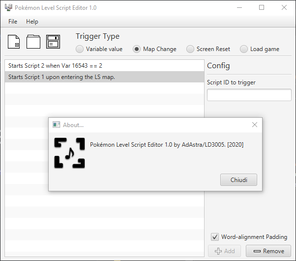

# Pokemon Level Script Editor
Little Java tool that loads and creates Level Script binary files.

## Info and usage
This tool was created with JavaFX in IntelliJ Idea. To run it, you will need the **latest Java 8 version** along with **JavaFX.**

### What this tool can do
- Create a level script from scratch
- Edit an existing level script

### What this tool can **not** do
- Insert a level script into a ROM.
For that, you'll need to manually edit the scripts narc ([\a\0\1\2] for HG/SS) and overwrite the file you need to replace.
