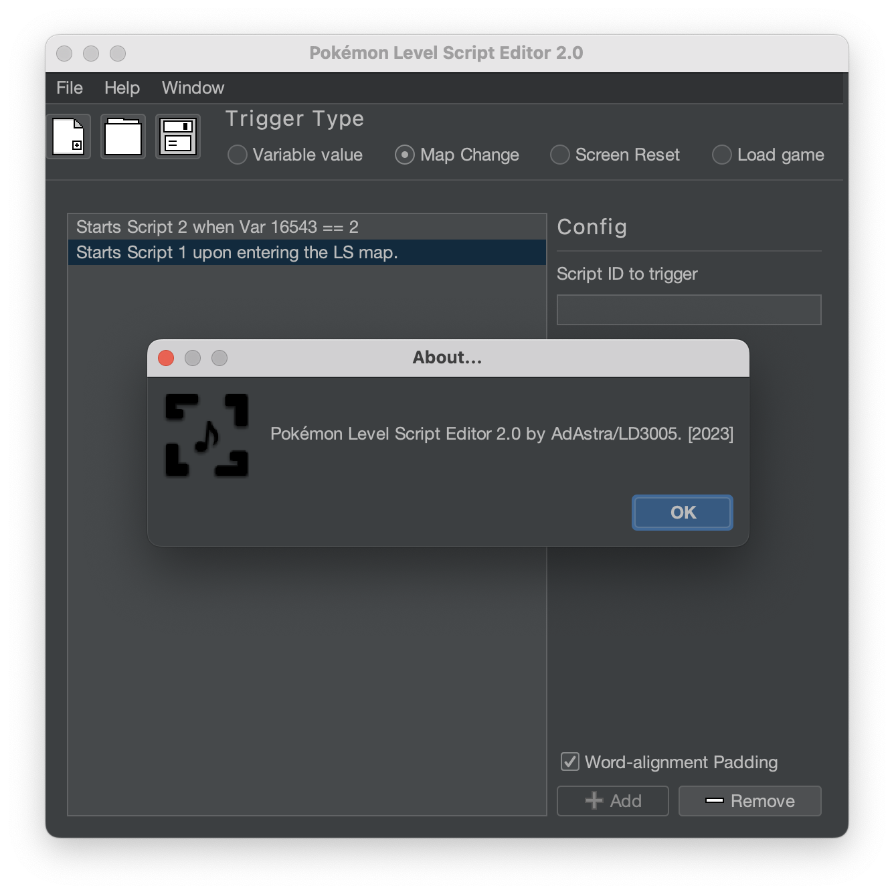

# Pokemon Level Script Editor
Little Java tool that loads and creates Level Script binary files.

## Info and usage
This tool was created with Swing/FlatLaF/JFormDesigner in IntelliJ IDEA. To run it, you will need the **latest Java 11 version.**

### What this tool can do
- Create a level script from scratch
- Edit an existing level script

### What this tool can **not** do
- Insert a level script into a ROM.
For that, you'll need to manually edit the scripts narc ([\a\0\1\2] for HG/SS) and overwrite the file you need to replace, or import the file using DSPRE.

### Contributors
- [AdAstra-LD](https://github.com/AdAstra-LD) - Literally everything important
- [turtleisaac](https://github.com/turtleisaac) - upgraded tool to Java 11 and made a new GUI for it

## Compiling/ Running the Source
To compile/run in an IDE, you'll need the Java 11 JDK and will have to add the libraries `MigLayout` and `formdev.flatlaf` to the project dependencies. This can be done with Maven, Gradle, etc...
